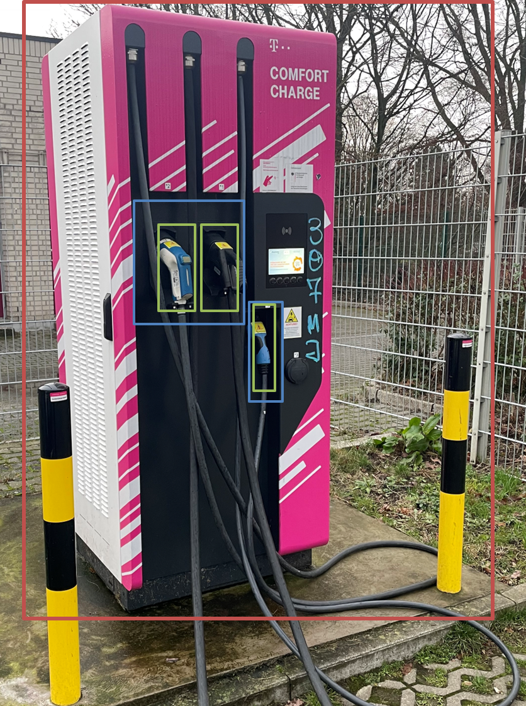
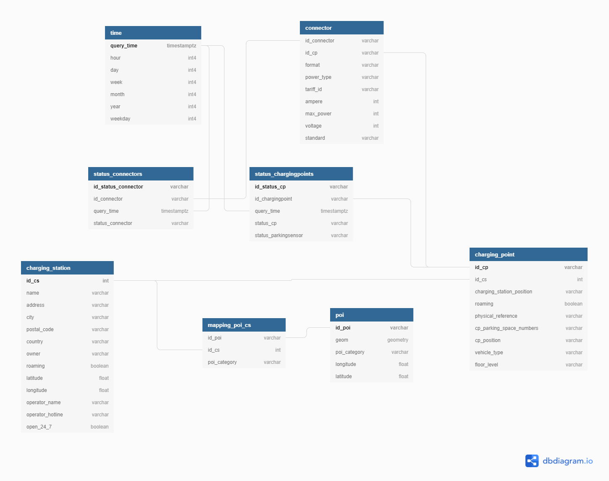

# Charging Infrastructure Data Modelling

The goal of 

The project was the Capstone Project for the Udacity Data Engineering Nanodegree Course. 

## Overview

Here you want to write a short overview of the goals of your project and how it works at a high level. If possible, include one or two images of the end product and architecture diagram (see examples below). diagrams.net is a great tool for creating architecture diagrams.

The goal of the project is to set up a maintainable and easy to extend data architecture and ETL-process for charging-data. Some example use cases for data model: 
- business reporting: generate utilization reports for single charging stations, cities or operators
- BI-dashboards: Generate interactive visualizations for visualizing charging station usage
- Predictive modelling: Use utilization data to predict usage development or determine optimal charging point locations 

The project consist of the following steps: 
1. Data Acquisition: Calling Chargecloud API in regular time intervals and storing raw results
2. Data Cleaning: Postprocess API results and transform data into flat files  
3. Data Modelling and ETL process: Ingesting charging data into Data Warehouse (Redshift) 

## Basics

The project contains data of electric vehicle charging stations. Here are a few basics to get familiar with charging infrastructure for electric vehicles. 

A *charging station (abbrev. cs)* (red box) is a piece of infrastructure at a single location where electric vehicles` batteries can be recharged. 

Each charging station consists of one or more *charging points (abbrev. cp)* (blue boxes), where a single electric vehicle can recharge at any given time.

Each charging point has one or more *connectors (abbrev. conn)* (green boxes) in order to satisfy different charging standards (e.g. Chademo, CCS, Type 2) or varying charging power levels (e.g. normal charging, fast-charging, ultra-fast charging). 

---
Each charging station with its charging points and connectors has static/semi-static master data. Examples of master data are the charging stations' location, address, operator, or the connectors maximum power level or connector type. 

Each chargingpoint and connector also has dynamic occupancy or status data, e.g. if the chargingpoint is occupied, reserved, 
free or out of order. 

The combination of static and dynamic data is used by car infotainment systems and apps to navigate the user to the nearest  
free and functional charging station. 

### Data Architecture

If you decide to include this, you should also talk a bit about why you chose the architecture and tools you did for this project.

### Data Model

### Data Visualization

## Prerequisites

Directions or anything needed before running the project.

- Prerequisite 1
- Prerequisite 2
- Prerequisite 3

## How to Run This Project

Replace the example step-by-step instructions with your own.

1. Install packages in `requirements.txt`
2. Run command: `python x`
3. Make sure it's running properly by checking z
4. To clean up at the end, run script: `python cleanup.py`

## Design Choices 

- use of data warehouse (Redshift) instead of data lake as data is (mostly) structured
- use of batch processing instead of streaming: the use case for this project is analyzing trends in user behavior or occupancy with 
descriptive statistics or as a basis for a machine learning model for predicting optimal charging station locations. Thus, daily batch updates
suffice and the use case does not justify extra complexity of streaming service like Kafka

- ingesting raw data into Redshift allows for flexible refactoring of data model
- separation each step of ETL process (Data Acquisition, Data Cleaning, Data Modelling and Loading) allows some or all 
of those steps can be moved to Airflow or AWS

## Lessons Learned

It's good to reflect on what you learned throughout the process of building this project. Here you might discuss what you would have done differently if you had more time/money/data. Did you end up choosing the right tools or would you try something else next time?

## Next Steps 

Here are a few steps to improve the project, but were out of scope of the capstone project 
- deal with additional columns not yet implemented in the data model (e.g. `opening_hours` or `capabilities`)
- deal with slowly changing dimension tables (SCD)
- implement data acquisition, batch processing and ETL in Airflow or AWS
- consider advantages and disadvantages of streaming data instead of batch processing

## Contact

Please feel free to contact me if you have any questions: 
- [linkedin](https://www.linkedin.com/in/nick-losacker/)
- [email](mailto:nick.losacker@eon.com)

# Acknowledgements 

[Data-Engineering Template by JPHaus](https://github.com/JPHaus/data-engineering-project-template)