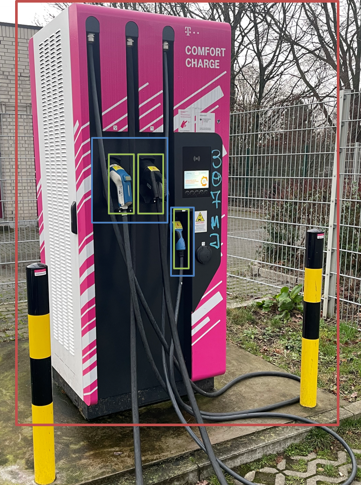

# Overview

The projects' goal is to dynamically model the occupancy of charging stations in Germany. The data is gathered from the [chargecloud API](https://www.chargecloud.de/), a German E-Mobility company providing back-end solutions for Charging Point Operators (CPOs). 

Additionally, to analyze relationship between utilization rate and the charging stations' surroundings [OpenStreetMap](https://www.openstreetmap.org) (*abbrev. OSM*) Points-of-Interest  (*abbrev. POI*) locations like food retailers, shopping malls, and highway services is included in the data model.  

The project serves as a basis for setting up a maintainable and easily extendable data architecture and ETL-process for charging-data. 

The project consist of the following steps: 
1. **Data Acquisition** 
    - Call chargecloud API in regular time intervals and store raw results
    - Retrieve OSM Points-of-Interest data for the cities where charging stations are placed 
2. **Data Cleaning** 
    - Postprocess API results and transform data into flat files of master data and utilization data
    - Match POI locations to charging station locations by spatial distance mapping between the two location datasets
3. **Data Modelling and ETL process**
    - Set up data model 
    - Ingest charging data and POI data into Data Warehouse (Redshift)

Some example use cases for data model: 
- business reporting: generate utilization reports for single charging stations, cities or operators
- BI-dashboards: Generate interactive visualizations for visualizing charging station usage
- Utilization analysis and predictive modelling: Use utilization data to examine the relationship between utilization and POIs in the charging station vicinity. Develop a model to predict usage development or determine optimal charging point locations with Machine Learning Models

## Basics

The project contains data of electric vehicle charging stations and charging events. Here are a few basics to get familiar with charging infrastructure and its terminology. 

A *charging station (abbrev. cs)* (red box) is a piece of infrastructure at a single location where an electric vehicle's battery can be recharged. 

Each charging station consists of one or more *charging points (abbrev. cp)* (blue boxes), where a single electric vehicle can recharge at any given time.

Each charging point has one or more *connectors (abbrev. conn)* (green boxes) in order to satisfy different charging standards (e.g. Chademo, CCS, Type 2) or varying charging power levels (e.g. normal charging, fast-charging, ultra-fast charging). 

---
Each charging station with its charging points and connectors has static/semi-static master data. Examples of master data are the charging stations' location, address, operator, or the connectors' maximum power level. 

Each charging point and connector also has dynamic occupancy or status data, e.g. if the charging point is occupied, reserved, 
free or out-of-order. 

The combination of static and dynamic data is used by car infotainment systems and apps to navigate the user to the nearest  
free and functional charging station. 

# Step 1: Data Acquisition
Script `data_acquisition.py`

1. Call chargecloud API in regular time intervals and save raw results
- Obtain charging stations in each city by making http request to `https://new-poi.chargecloud.de/<city>`. Result contains dynamic occupancy data and static master data
- Save raw results 

2. Retrieve OSM POI data in charging stations' vicinity
- Download POI data in charging stations cities with [osmnx](https://github.com/gboeing/osmnx) library. The POIs are specified with the `TAGS` dictionary containing OSM [tags](https://wiki.openstreetmap.org/wiki/Tags) as key-value pairs. 
- Save results as shapefiles

# Step 2: Data Cleaning 
Script `preprocess_results.py`
1. Preprocessing API results: 
- Extract charging stations' and connectors' dynamic occupancy data from API results. 
- Extract charging station, charging point and connector master data from API results. 

2. Spatial matching between charging stations and POIs
- Compute which POIs are in the vicinity of each charging station and create mapping table 

# Step 3: Data Modelling and Ingestion
Data Modeling: `sql.py` 
1. Set up [Data Model](#Data-Model)

- Each table is defined by `DataIngester` object containing the following parameters:
    - `table_name`: name of database table 
    - `drop_table`: SQL statement for dropping table
    - `create_table`: SQL statement for creating table 
    - `populate_table`: SQL statement for populating table with records (e.g. copy or insert) 
    - `drop_constraints`: SQL statement for dropping constraints
    - `data_test_cases`: list of SQL data quality checks that are run after table creation 

2. Data Ingestion: `etl.py` 
- Executing sequence of data ingestion tasks 

# Data Model 

The data model incorporates two fact tables (status information of charging points and connectors) and 
six dimension tables. Four dimension tables contain master data of the charging stations and its equipment (charging stations, charging points, connectors and time metadata) and two contain POI location information (POI table and mapping table between charging stations and poi)

## Fact tables 

- `status_chargingpoints`: status of charging point

| column    name   | description           | datatype  |
| :--|:-------------|:-----|
| **id_status_cp**      |  unique identifier of chargingpoint status |varchar |
| id_chargingpoint      |  charging point id |varchar |
| query_time | timestamp of API call  |   timestamptz |
| status_cp |    status of charging point |    varchar |
| status_parkingsensor |   status of parking sensor (if available)  |    varchar |

---
- `status_connectors`: status of connectors

| column    name   | description           | datatype  |
| :--|:-------------|:-----|
| **id_status_connectors**      |  unique identifier of connector status |varchar |
| id_connector      |  connector id |varchar |
| query_time | timestamp of API call    |   timestamptz |
| status_connector |   status of connector  |    varchar |

## Dimension tables 
- `charging_station` charging station master data

| column    name   | description           | datatype  |
| :--|:-------------|:-----|
| **id_cs** |    unique identifier for charging station  |    int |
| name |   charging station name  |    varchar |
| address | charging station address (street + house number)   |    varchar |
| city |   charging station city |    varchar |
| postal_code | charging station postal code |    varchar |
| country | charging station country |    varchar |
| owner | charging station owner (if different than charging point operator) |    varchar |
| roaming | whether roaming is available |    boolean |
| longitude | charging station longitude (EPSG 4326) |    float |
| latitude | charging station latitude (EPSG 4326) |    float |
| operator_name | charging station operator (CPO) |    varchar |
| operator_hotline | charging station operator hotline |    varchar |
| open_24_7 | whether charging station is open 24/7 |    boolean |

---
- `charging_point` charging point master data

| column    name   | description           | datatype  |
| :--|:-------------|:-----|
| **id_cp** |    unique identifier for charging point  |    varchar |
| id_cs |  unique identifier to corresponding charging station  |    int |
| charging_station_position |  description specifying charging station position  |    varchar |
| cp_position |  description specifying charging point position (e.g. left or right charging point)  |    varchar |
| vehicle_type | suitable type of vehicle    |    varchar |
| floor_level |  charging point floor level  |    varchar |

---

- `connector` connector master data

| column    name   | description           | datatype  |
| :--|:-------------|:-----|
| **id_connector** |    unique identifier for connector  |    varchar |
| id_cp |   unique identifier for charging point  |    varchar |
| format |  type of plug (socket or permanently installed cable)  |    varchar |
| power_type |  type of power (AC 1-Phase, AC 3-Phase, DC)  |    varchar |
| ampere |  maximum amperage  |    int |
| voltage |  nominal voltage   |    int |
| max_power |  maximum charging power  |    int |
| standard |   charging standard (Chademo, IEC 62196) |    varchar |

---

- `time` time metadata

| column    name   | description           | datatype  |
| :--|:-------------|:-----|
| **query_time** |   time of API call |    timestamptz |
| hour |   timestamp hour of day  |    int4 |
| day |  timestamp day of month  |    int4 |
| week |   timestamp week of year|    int4 |
| month | timestamp month  |    int4 |
| year |  timestamp  year |    int4 |
| weekday |  timestamp day of week  |    int4 |

---

- `poi` OSM POI locations

| column    name   | description           | datatype  |
| :--|:-------------|:-----|
| **id_poi** |   OSM id (combination of osm-type and osm id) |    varchar |
| geom |   POI geometry |    geometry |
| longitude |  POI longitude (EPSG 4326)  |    float |
| latitude |   POI latitude (EPSG 4326)    |    float |
| poi_category |   timestamp week of year|    varchar |

---

- `mapping_poi_cs` Mapping table between POIs and charging stations based on distance matching

| column    name   | description           | datatype  |
| :--|:-------------|:-----|
| id_poi|   OSM id (combination of osm-type and osm id) |    varchar |
| id_cs |   unique identifier for charging station  |    int |

# Design Choices 
- Data Lake vs. Data Warehouse
- Redshift vs. PostGres

n_cp = 2423

n_conn = 2806

n_total = n_cp + n_conn

n_total * 365 * 24 * 6

- Batch Processing vs. Streaming. 
- 

# Next Steps 

Here are the next steps which would improve the project, but were out of scope of the capstone project 
- create charging events table for computing number of charging events, charging station availability or approximate energy transfer
- deal with additional columns not yet implemented in the data model (e.g. charging stations' `opening_hours` or charging points' `capabilities`)
- deal with slowly changing dimension tables (SCD)
- implement data acquisition, batch processing and ETL in Airflow or AWS
- consider advantages and disadvantages of streaming data instead of batch processing
- develop a dashboard based on data model 
- expand the number of POI categories considered

# Addressing other scenarios 

- Currently the the data gathered results in roughly 275 million rows a year or about 750k rows per day. 
If the data volume was to be increased by 100x (28 billion rows per year or 75 million rows per day) Redshift would still be a viable option. Batch ingestion once or twice a day would still be a viable option as this data volume. However, it could be advisable to 
either ingest data more than once a day or split ingestion into smaller chunks.

- If the pipeline would be run on a daily basis I would consider Airflow as an orchestration tool. 
There could be different DAGs for ingestion jobs on different scheduling intervals: 
    - chargecloud API call (e.g. every 10 minutes)
    - batch data ingestion into status and master data tables (once or twice a day)
    - batch data ingestion of OSM data (once or twice a month)

    AWS services like AWS step and lambda functions could be a viable alternative. 

- If the database needed to accessed by 100+ people, Redshift allows for sufficient horizontal and vertical scaling with low latency and high concurrency. It could be beneficial to use the API query time as a distribution key, since recent data (last week or last month) is probably more business relevant than historic data. To allow for batch downloading of historic data (last years) building a separate self-service API take load off the main Data Warehouse.    
 

